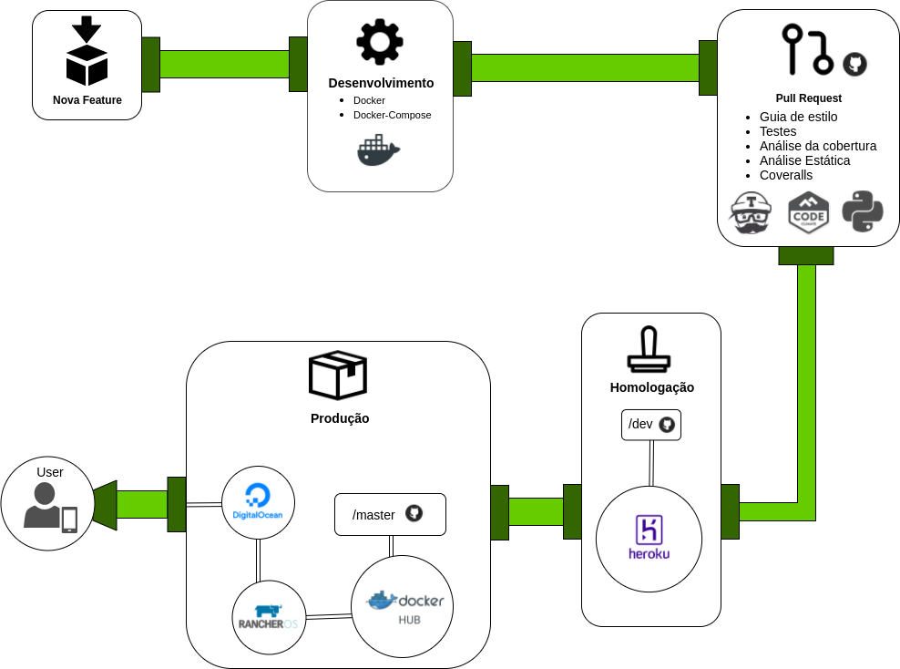

# Pipeline de Back-end

## Desenvolvimento - Docker
O Docker é uma tecnologia que possibilita isolarmos o ambiente de desenvolvimento por meio de "containers", de maneira que todos os desenvolvedores tenham acesso à mesma versão dos programas necessários. Por oferecer uma camada de abstração e automação de virtualização a nível de sistema operacional, esse mecanismo consegue oferecer um desempenho muito maior do que uma máquina virtual, que simula um sistema operacional completo e divide o desempenho do hardware.

## Homologação - Heroku
Após as entregas, é feito um Pull Request para a branch "dev", o qual precisa cumprir os seguintes fatores: ser aprovado pela ferramenta de Integração Contínua "Travis CI", ser aprovado na Análise Estática feita pela ferramenta Code Climate e possuir acima de 90% de cobertura de testes. Somente então após a aprovação e merge para a branch, o Heroku, que é uma ferramente gratuita, recebe por meio de webhook as alterações de código na branch do repositório de microsserviços de comentários e eventos, assim implementando no servidor de homologação.

## Produção - Docker HUB, Rancher, Digital Ocean
Quando a entrega da feature chega na branch "master", a ferramenta Docker HUB, via webhook, captura as alterações de código realizadas na branch do GitHub. O Rancher, também via webhook, captura quaisquer mudanças e atualiza os containers. O mesmo é hospedado no servidor provido pela empresa DigitalOcean.