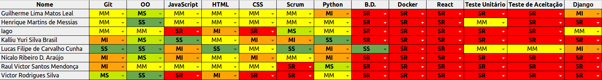

## Informações

|Sprint|Nº|
|--------|---------|
|Início|21/08/2018|
|Término|27/08/2018|
|Duração|7 Dias|
|Pontos planejados|12|
|Pontos planejados e concluídos|12|
|Pontos dívidas passadas|0|
|Pontos dívidas passadas concluídos|0|
|Pontos adicionados|0|
|Pontos adicionados concluídos|0|
|Pontuação total planejada|12|
|Pontuação total concluída|12|
|Dívida para próxima sprint|0|

## Papéis

|Papéis|Responsável|
|--------|---------|
|Scrum Master|Lucas Cunha|
|DevOps|Lucas Cunha|
|Arquiteto|Lucas Cunha|
|Product Owner|Lucas Cunha|
|Time de Desenvolvimento|Guilherme Leal, Henrique Martins, Iago Oliveira, Kalliu Brasil, Nícalo Ribeiro, Raul Victor, Victor Rodrigues|

## Planning

### Presenças

|Membro|Presença|
|--------|---------|
|Lucas Cunha|Sim|
|Guilherme Leal|Sim|
|Henrique Martins|Sim|
|Iago Oliveira|Sim|
|Kalliu Brasil|Sim|
|Nícalo Ribeiro|Não|
|Raul Victor|Sim|
|Victor Rodrigues|Sim|

## Overview

-Sprint inical da matéria.

## Conhecimento

## Pareamento

## Sprint Backlog

|Issue|	Descrição|	Pontos|	Responsáveis|
|-----|----------|--------|-------------|
|#8| Treinamento de Metodologia  | 5 |Lucas Cunha|
|#10| Definição de reunião incial| 1 |Lucas Cunha|
|#17| Iniciar Documentação       | 5 |Lucas Cunha|
|#19| Definição de Rituais       | 1 |   Time    |

## Restrospective 

### Presenças
|Membro|Presença|
|--------|---------|
|Lucas Cunha|Sim|
|Guilherme Leal|Sim|
|Henrique Martins|Sim|
|Iago Oliveira|Sim|
|Kalliu Brasil|Sim|
|Nícalo Ribeiro|Sim|
|Raul Victor|Sim|
|Victor Rodrigues|Sim|

### Pontos Positivos
- Conhecer pessoas novas.
- EPS entende da metodologia SCRUM

### Pontos Negativos

- Montou o grupo com atraso em relação ao cronograma da matéria.
- Inexperiência do time de EPS com tecnologias.
- Não comparecimento nos treinamentos e rituais dos membros de MDS.
- Demora no contato com alguns membros do grupo.
- Falta de Experiência com trabalho em grupo.
### Melhorias

- Comunicação e presença nos rituais. 

## FeedBack
- Sprint inical da matéria, como o grupo foi formado com uma semana de atraso com pessoas desconhecidas teve-se uma dificuldade na comunicação inicial.  
- Time de MDS e EPS são desconhecidos uns para os outros. 
- Teve-se muitas ausências dos membros de MDS nos compromissos marcados. 