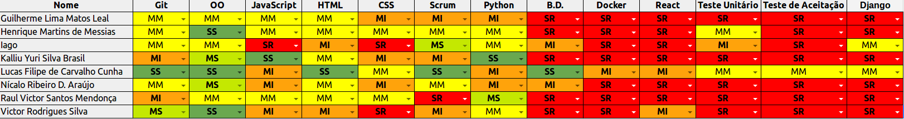

## Informações

|Sprint|Nº|
|--------|---------|
|Início|04/09/2018|
|Término|10/09/2018|
|Duração|7 Dias|
|Pontos planejados|-|
|Pontos planejados e concluídos|-|
|Pontos dívidas passadas|-|
|Pontos dívidas passadas concluídos|-|
|Pontos adicionados|-|
|Pontos adicionados concluídos|-|
|Pontuação total planejada|-|
|Pontuação total concluída|-|
|Dívida para próxima sprint|-|

## Papéis

|Papéis|Responsável|
|--------|---------|
|Scrum Master|Lucas Cunha|
|DevOps|Lucas Cunha|
|Arquiteto|Lucas Cunha|
|Product Owner|Lucas Cunha|
|Time de Desenvolvimento|Guilherme Leal, Henrique Martins, Iago Oliveira, Kalliu Brasil, Nícalo Ribeiro, Raul Victor, Victor Rodrigues|

## Planning

### Presenças

|Membro|Presença|
|--------|---------|
|Lucas Cunha|Sim|
|Guilherme Leal|Sim|
|Henrique Martins|Sim|
|Iago Oliveira|Sim|
|Kalliu Brasil|Sim|
|Nícalo Ribeiro|Sim|
|Raul Victor|Sim|
|Victor Rodrigues|Sim|

## Overview

## Conhecimento

## Pareamento

## Sprint Backlog

|Issue|	Descrição|	Pontos|	Responsáveis|
|-----|----------|--------|-------------|
|#117| Definir métricas de código| 8 |Lucas Cunha|
|#139| Elaborar Canvas| 8 |Lucas Cunha|
|#140| Git Rebase          | 5 |Time de Desenvolvimento|
|#139| Construir Documento de Arquitetura      | 21 |Time de Desenvolvimento|
|#170| Template de documentações dos rituais   | 8 |Lucas Cunha|
|#171| Configuração do ambiente React-Native   | 3 |Time de Desenvolvimento|
|#172| Aperfeiçoar habilidades em React-Native | 40 |Time de Desenvolvimento|
|#144| RoadMap dos Papéis    | 40 |Lucas Cunha|
|#149| Definir métricas de produtividade  | 8 |Lucas Cunha|
|#53 | Construir EAP      | 8 |Lucas Cunha|
|#53 | Atualizar TAP      | 3 |Lucas Cunha|

## Restrospective 

### Presenças
|Membro|Presença|
|--------|---------|
|Lucas Cunha|Sim|
|Guilherme Leal|Sim|
|Henrique Martins|Sim|
|Iago Oliveira|Sim|
|Kalliu Brasil|Sim|
|Nícalo Ribeiro|Sim|
|Raul Victor|Sim|
|Victor Rodrigues|Sim|

### Pontos Positivos

### Pontos Negativos

### Melhorias

## Métricas

## FeedBack
