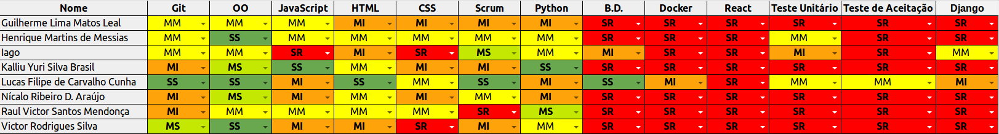

## Informações

|Sprint|Nº|
|--------|---------|
|Início|28/08/2018|
|Término|03/09/2018|
|Duração|7 Dias|
|Pontos planejados|43|
|Pontos planejados e concluídos|43|
|Pontos dívidas passadas|0|
|Pontos dívidas passadas concluídos|0|
|Pontos adicionados|0|
|Pontos adicionados concluídos|0|
|Pontuação total planejada|43|
|Pontuação total concluída|43|
|Dívida para próxima sprint|0|

## Papéis

|Papéis|Responsável|
|--------|---------|
|Scrum Master|Lucas Cunha|
|DevOps|Lucas Cunha|
|Arquiteto|Lucas Cunha|
|Product Owner|Lucas Cunha|
|Time de Desenvolvimento|Guilherme Leal, Henrique Martins, Iago Oliveira, Kalliu Brasil, Nícalo Ribeiro, Raul Victor, Victor Rodrigues|

## Planning

### Presenças

|Membro|Presença|
|--------|---------|
|Lucas Cunha|Sim|
|Guilherme Leal|Sim|
|Henrique Martins|Sim|
|Iago Oliveira|Sim|
|Kalliu Brasil|Sim|
|Nícalo Ribeiro|Sim|
|Raul Victor|Sim|
|Victor Rodrigues|Sim|

## Overview

## Conhecimento

## Pareamento

## Sprint Backlog

|Issue|	Descrição|	Pontos|	Responsáveis|
|-----|----------|--------|-------------|
|#18| Levantar Requisitos                       | 3 |      Lucas Cunha      |
|#25| Definir pipeline de de integração do app  | 3 |      Lucas Cunha      |
|#24| Estudar Microserviços                     | 5 |      Lucas Cunha      |
|#21| Tópicos do perfil de comunidade OpenSource| 5 |      Lucas Cunha      |
|#31| Dockerizar Docusaurus                     | 8 |      Lucas Cunha      |
|#26| Definir Pipeline Inicial com Travis       | 5 |      Lucas Cunha      |
|#15| Template do GithubPages                   | 2 |      Lucas Cunha      |
|#30| Protótipo de baixa fidelidade             | 2 |Time de Desenvolvimento|
|#11| Dojo de React-Native                      | 5 |         TIME          |
|#12| Treinamento de Python+Django              | 5 |         TIME          |

## Restrospective 

### Presenças
|Membro|Presença|
|--------|---------|
|Lucas Cunha|Sim|
|Guilherme Leal|Sim|
|Henrique Martins|Sim|
|Iago Oliveira|Sim|
|Kalliu Brasil|Sim|
|Nícalo Ribeiro|Não|
|Raul Victor|Não|
|Victor Rodrigues|Sim|

### Pontos Positivos

### Pontos Negativos

### Melhorias

## Métricas

## FeedBack
