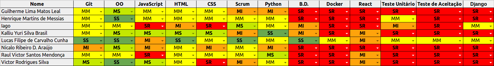

## Informações

|Sprint|Nº|
|--------|---------|
|Início|11/09/2018|
|Término|17/09/2018|
|Duração|7 Dias|
|Pontos planejados|21|
|Pontos planejados e concluídos|-|
|Pontos dívidas passadas|-|
|Pontos dívidas passadas concluídos|-|
|Pontos adicionados|-|
|Pontos adicionados concluídos|-|
|Pontuação total planejada|-|
|Pontuação total concluída|-|
|Dívida para próxima sprint|-|

## Papéis

|Papéis|Responsável|
|--------|---------|
|Scrum Master|Lucas Cunha|
|DevOps|Lucas Cunha|
|Arquiteto|Lucas Cunha|
|Product Owner|Lucas Cunha|
|Time de Desenvolvimento|Guilherme Leal, Henrique Martins, Iago Oliveira, Kalliu Brasil, Nícalo Ribeiro, Raul Victor, Victor Rodrigues|

## Planning

### Presenças

|Membro|Presença|
|--------|---------|
|Lucas Cunha|Sim|
|Guilherme Leal|Sim|
|Henrique Martins|Sim|
|Iago Oliveira|Sim|
|Kalliu Brasil|Sim|
|Nícalo Ribeiro|Não|
|Raul Victor|Sim|
|Victor Rodrigues|Sim|

## Overview
- Sprint com objetivo de dessiminar conteudos entre os membros de MDS para suprir a falta de conhecimento devido a faltas nos treinamentos.
- Consturir documentos iniciais necessários para o desenvolvimento.

## Conhecimento

## Pareamento
- Guilherme e Iago.
- Victor e Kalliu.
- Henrique e Raul.

## Sprint Backlog

|Issue|	Descrição|	Pontos|	Responsáveis|
|-----|----------|--------|-------------|
|#117| Definir métricas de código| 8 |Lucas Cunha|
|#139| Elaborar Canvas| 8 |Lucas Cunha|
|#140| Git Rebase          | 5 |Time de Desenvolvimento|
|#139| Construir Documento de Arquitetura      | 21 |Time de Desenvolvimento|
|#170| Template de documentações dos rituais   | 8 |Lucas Cunha|
|#171| Configuração do ambiente React-Native   | 3 |Time de Desenvolvimento|
|#172| Aperfeiçoar habilidades em React-Native | 40 |Time de Desenvolvimento|
|#144| RoadMap dos Papéis    | 40 |Lucas Cunha|
|#149| Definir métricas de produtividade  | 8 |Lucas Cunha|
|#53 | Construir EAP      | 8 |Lucas Cunha|
|#53 | Atualizar TAP      | 3 |Lucas Cunha|

## Restrospective 

### Presenças
|Membro|Presença|
|--------|---------|
|Lucas Cunha|Sim|
|Guilherme Leal|Sim|
|Henrique Martins|Sim|
|Iago Oliveira|Sim|
|Kalliu Brasil|Sim|
|Nícalo Ribeiro|Não|
|Raul Victor|Sim|
|Victor Rodrigues|Sim|

### Pontos positivos
- Integrantes saíram da inércia.
- Aumento de presença nas Dailys.
- Todos seguindo o gitflow.

### Pontos negativos
- Falta de transparência na daily meeting.
- Falta de responsabilidade no comprimento das tarefas.
- Atraso nas entregas.
- Dificuldades para configurar o ambiente do React/Docker.
- Alguns membros da equipe com problemas de saúde.
- Dispersão de alguns membros nos rituais. 

### Melhorias
- Comunição.
- Comprometimento de alguns membros.
- Comunicação com outros grupos do aplicativo.
- Pull Requests.
- Aumentamo de entregas.

## FeedBack
- Muitas reclamações referentes a presença nos rituais.
- Membros tendo problemas de relacionamentos devido a falta de responsabilidade de alguns membros.
- Infelizmente a maioria do tempo gasto tem sido em alguns membros puxando a produção para outros.
- O desgaste e o cansaço causado pelos conflitos tem prejudicado consideravelmente o trabalho.
- Muitos membros não mostram a matéria como prioridade.
