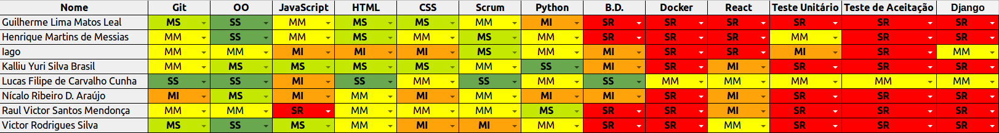

## Informações

|Sprint|Nº|
|--------|---------|
|Início|18/09/2018|
|Término|24/09/2018|
|Duração|7 Dias|
|Pontos planejados|-|
|Pontos planejados e concluídos|-|
|Pontos dívidas passadas|-|
|Pontos dívidas passadas concluídos|-|
|Pontos adicionados|-|
|Pontos adicionados concluídos|-|
|Pontuação total planejada|-|
|Pontuação total concluída|-|
|Dívida para próxima sprint|-|

## Papéis

|Papéis|Responsável|
|--------|---------|
|Scrum Master|Lucas Cunha|
|DevOps|Lucas Cunha|
|Arquiteto|Lucas Cunha|
|Product Owner|Lucas Cunha|
|Time de Desenvolvimento|Guilherme Leal, Henrique Martins, Iago Oliveira, Kalliu Brasil, Nícalo Ribeiro, Raul Victor, Victor Rodrigues|

## Planning

### Presenças

|Membro|Presença|
|--------|---------|
|Lucas Cunha|Sim|
|Guilherme Leal|Sim|
|Henrique Martins|Sim|
|Iago Oliveira|Sim|
|Kalliu Brasil|Sim|
|Nícalo Ribeiro|Sim|
|Raul Victor|Sim|
|Victor Rodrigues|Sim|

## Overview

## Conhecimento

## Pareamento

## Sprint Backlog

|Issue|	Descrição|	Pontos|	Responsáveis|
|-----|----------|--------|-------------|
|#88| US06 | 3 |Lucas e Henrique|
|#85| US04    | 5 |Time de Desenvolvimento|
|#87| Implementar pipeline de dploy e entrega continua de microserviços | 8 |Lucas Cunha|
|#86| Elaborar ROI | 2 |Lucas Cunha|

## Restrospective 

### Presenças
|Membro|Presença|
|--------|---------|
|Lucas Cunha|Sim|
|Guilherme Leal|Sim|
|Henrique Martins|Sim|
|Iago Oliveira|Sim|
|Kalliu Brasil|Sim|
|Nícalo Ribeiro|Sim|
|Raul Victor|Sim|
|Victor Rodrigues|Sim|

### Pontos Positivos

### Pontos Negativos

### Melhorias

## Métricas

## FeedBack
